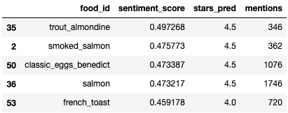
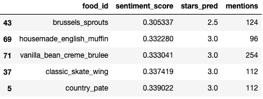

# Rating Restaurant Features using Yelp Reviews
Analyzing Yelpers' sentiments of specific entities to rate a restaurant's dishes and key features.

_Author: Ritchie Kwan_

---

## Table of Contents
0. [Converting JSON to CSV](code/00-converting-json-to-csv.ipynb)
1. [Cleaning Data](code/01-cleaning-data.ipynb)
2. [Exploratory Data Analysis](code/02-eda.ipynb)
3. [Selecting Data](code/03-selecting-a-restaurant.ipynb)
4. Preparing Data
    1. [Extracting Sentences](code/04.1-extracting-sentences.ipynb)
    2. [Extracting Chunks](code/04.2-extracting-chunks.ipynb)
5. Rating Entities
    1. UC01 - [Rating Dishes](code/05.1-rating-dishes.ipynb)
    2. UC02 - [Rating Key Features](code/05.2-rating-features.ipynb)
    3. UC03 - Best Dish in Town(WIP)
6. [Evaluating Predictions](code/06-evaluating-predictions.ipynb)

## Presentation
[Rating Yelp Dishes](https://docs.google.com/presentation/d/1AJK0bjvfv5uJDRuppb7xC9GwR_sUUkeGrc7KPsJZdw0/edit?usp=sharing)
Note: At the time of this presentation, dishes were the only entities of interest. I have since expanded the project to include key features.

## Problem Statement
A single 5-star rating system on a restaurant might give you an idea of which restaurant to go to, but it does not specifically rate any particular feature. Key features could be specific menu items, freshness, tastiness, service, speediness, cleanliness. A 4.5-star restaurant does not mean all of its dishes are 4.5 star dishes. It could have 5-star dishes, probably a few 1-star dishes, 4-star service, 2-star speediness. A Yelper should be able to immediately see what dishes are recommended by reviewers, which restaurant has the best service, and so on.

Enter **[Named-Entity Recognition](https://en.wikipedia.org/wiki/Named-entity_recognition)** (NER) and **[Sentiment Intensity Analysis](https://www.kdnuggets.com/2018/08/emotion-sentiment-analysis-practitioners-guide-nlp-5.html)** (SIA).

Performing NER to detect key features of a restaurant, then SIA to predict the  sentimental score of those features can provide more detailed insight about a business than a generalized star rating. SIA on sentence fragments of reviews that mention specific menu items can predict the true rating of each dish.

## Assumptions
With a sufficient number of reviews that mention a particular dish, the quality of a menu item's can be accurately predicted by aggregating the sentiment of the reviews.
It is assumed that Yelp has already removed fake reviews, so all reviews being analyzed have honest opinions.

## Executive Summary
### Goal
Predict the quality of a restaurant's menu items and key features by analyzing fragments of reviews that mention specific menu items and features of interest.  Features may include: Tastiness, quality of service, cleanliness of bathrooms, speediness.

#### Use Case 1:  Yelper wants to know the best dishes to order at a certain restaurant.
1. Select a restaurant.
2. Collect all reviews from that restaurant.
3. Perform NER and SIA. Predict a rating for each dish.
4. Display menu items, sorted by rating.
5. Result: The top-rated dishes are the restaurant's highest recommended menu items.

##### The best dishes

##### The worst dishes

#### Use Case 2: Yelper wants to get an overview of a restaurant's key features.
1. Select a restaurant.
2. Collect all reviews from that restaurant.
3. Perform NER and SIA. Predict a rating for each key feature.
4. Display the key features.
5. Result: The top-rated features are the restaurant's best features.

#### Use Case 3: Yelper wants to know where to get the best version of a dish in town.
1. Select a dish and a region (zip code, city).
2. Find all restaurants in the region that serve the dish.
3. Perform NER and SIA on reviews that mention the dish for each restaurant and predict a rating for each restaurant.
4. Display the restaurants, sorted by rating of the dish.
5. Result: The top-rated restaurants serve the best versions of that dish.

## Statistical Analysis

### Metrics
This is an unsupervised analysis, so the metric of success is getting a sufficiently diverse distribution of sentiment scores / ratings for each restaurant's menu items. Comparing the predicted best dishes to Yelp's most reviewed dishes could be a viable metric.

### Findings
* Preliminary analysis features Mon Ami Gabi, the most reviewed restaurant in the dataset with 7968 reviews. Most restaurants have less than 100 reviews, so performing the same analysis on such a small sample of reviews may produce unreliable results.
* SIA was performed at three levels of detail: Review, Sentence, and Chunk. Chunks are sentence fragments containing up to 7 words before and after the entity of interest. Chunk-level SIA proved have the highest variance of sentiment scores.

#### Example: Entity of interest is *onion soup*.
##### Most positive chunks

##### Most negative chunks

##### Average sentiment chunks

##### Distribution of sentiment by level of detail: Review, Sentence, and Chunk

Review-level SIA is inflated to 1.0, so aggregating the scores may not be very useful. Sentence and Chunk-level SIA result in higher spreads of sentiment scores and will therefore produce more meaningful results when comparing restaurants.

### Challenges / Improvements
* Determining how many times an entity should be mentioned to have a reliable rating.
* Sentence fragment extraction is performed on single sentences. The sentiment of a multi-sentence fragment like "I ordered the french onion soup. It was delicious." is missed. This is a challenge of context, i.e. determining which entity "it" is referring to.
* Sentence fragments may still include sentiments meant for a different entity.
    * Example sentence: "The onion soup was great, the steak was terrible, the lemon tarte was delicious." will get processed as `"the onion soup was great the steak was terrible the"` instead of `"the onion soup was great"`.
* Converting sentiment score to stars requires fine tuning. The current version uniformly distributes the score range `[-1,1]` to discrete stars `[1,5]`. In reality a score between `[-1, .1]` could all be 1 star ratings.
* Sentiments about certain features can be unbalanced due to the nature of the feature. Reviewers are more likely to write about bad service than good service. The same could apply to features like cleanliness.
* NER performance could be improved by capturing more name variations. Or, Yelp could add a tagging functionality so reviewers could tag keywords like dish names and key features.  
* SIA could be improved by tuning a custom sentiment model to accurately evaluate slang.
